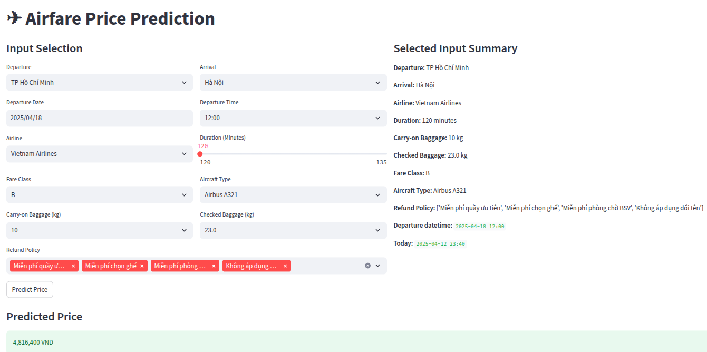
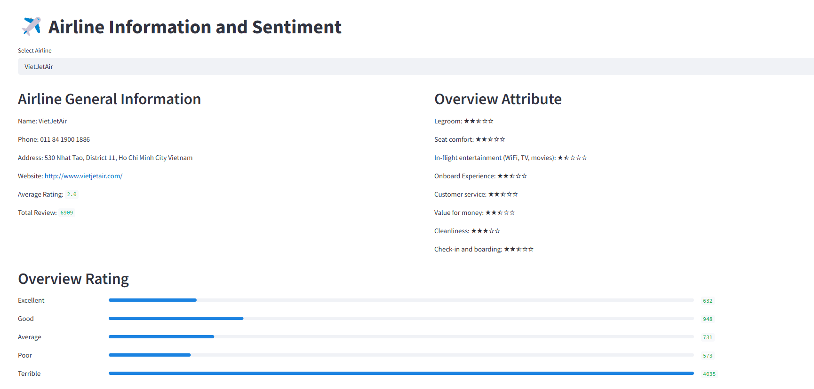
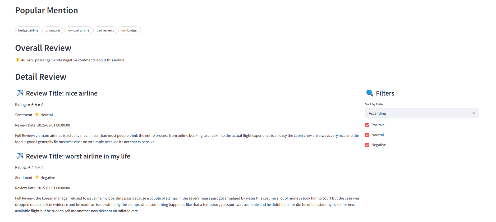
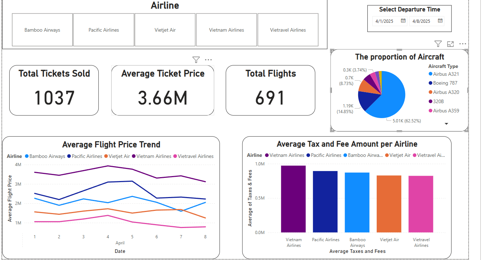

# AIRFARE PROJECT
## Table of Contents
- [1. Project Overview](#1-project-overview)
- [2. Project Architecture & Folder Structure](#2-project-architecture--folder-structure)
- [3. Part 1 – Airfare Price Prediction](#3-part-1--airfare-price-prediction)
  - [3.1 Objective](#31-objective)
  - [3.2 Dataset Description](#32-dataset-description)
  - [3.3 Pipeline Components](#33-pipeline-components)
    - [3.3.1 Crawling](#331-crawling)
    - [3.3.1 ETL and Normalization](#332-etl-and-normalization)
    - [3.3.1 Preprocessing for Modeling](#333-preprocessing-for-modeling)
    - [3.3.1 Model Training and Selection](#334-model-selection-and-training)
    - [3.3.1 Inference](#335-inference)
  - [3.4 Automation & Cron Setup](#34-automation-and-cron-setup)
  - [3.5 FastAPI](#37-fastapi)
  - [3.6 Streamlit Airfare Prediction App](#38-streamlit-airfare-prediction-app)
  - [3.7 Technology Stack](#39-technology-stack)
- [4. Part 2 – Airline Review Sentiment Analysis](#4-part-2--airline-review-sentiment-analysis)
- [5. Setup & Usage](#5-setup--usage)
  - [5.1 Install environment](#51-install-environment)
  - [5.2 Run pipeline](#52-run-pipeline)
- [6. Authors & Contribution](#6-authors--contribution)

## 1. Project Overview

This project aims to build an end-to-end automated data pipeline and machine learning system for predicting airfare prices and analyzing airline review sentiments. It's divided into 2 main parts:
- Part 1: Airfare Price Prediction — Predict flight ticket prices based on route, airline, time, fare class, and more.
- Part 2: Airline Review Sentiment Analysis — Analyze passenger reviews to extract sentiment insights for airline services.

The system includes web crawling, ETL (Extract, Transform, Load), model training, evaluation, and deployment.

## 2. Project Architecture & Folder Structure
```
.
├── data/                 # Raw, cleaned, and modeling data
│   ├── clean/            # Clean data
│   ├── data_for_modeling/# Data used to model
│   └── raw/              # Raw data
├── logs/                 # Log files for monitoring
├── models/               # Saved model and preprocessing artifacts
├── notebooks/            # Jupyter notebooks for EDA and testing
├── schema_docs/          # Markdown schema documentation
├── scripts/              # Shell scripts for automation
├── src/                  # Source code modules
│   ├── api/              # Web app / FastAPI / Streamlit
│   ├── crawler/          # Web scrapers for flights and reviews
│   ├── deployment/       # Inference logic
│   ├── etl/              # ETL and data cleaning scripts
│   ├── modeling/         # Training and preprocessing data model
│   └── utils/            # Common utilities and helpers
├── run_flight_prices_pipeline.py   # Entry point for the full pipeline
├── requirements.txt      # Required packages
└── README.md
```

## 3. Part 1 – Airfare Price Prediction
### 3.1 Objective
This module aims to predict the total price of a flight ticket based on various features including departure time, airline, aircraft type, fare class, route, and baggage policy. The pipeline is designed to automatically fetch real-time airfare data, process it, and train a machine learning model for accurate price estimation.

### 3.2 Dataset Description
- Data Source: Crawled from [Abay.vn](https://www.abay.vn)
- Collected Routes: SGN (Ho Chi Minh City) → HAN (Ha Noi City), SGN (Ho Chi Minh City) → DAD (Da Nang City)
- Sample Fields:
    - Departure Time, Arrival Time, Scrape Time
    - Airline, Flight Code, Fare Class
    - Carry-on Baggage, Checked Baggage, Aircraft Type, Number of Tickets, Passenger Type
    - Price per Ticket, Taxes & Fees, Total Price
    - Departure Location, Arrival Location

### 3.3 Pipeline Components
#### 3.3.1 Crawling
- Script: [`src/crawler/abay_form_oneway.py`](src/crawler/abay_form_oneway.py)
- Uses Selenium + undetected-chromedriver
- Inputs: departure airport, destination, date range
- Outputs: raw CSV files in data/raw/<date>/

#### 3.3.2 ETL and Normalization
- Script: [`src/etl/preprocessing_flight_prices.py`](src/etl/preprocessing_flight_prices.py)
- Extracts and cleans all columns
- Normalizes into:
    - AIRPORT
    - AIRLINE
    - REFUND_POLICY
    - FLIGHT_SCHEDULE
    - TICKET
- Load data:
    - Into SQL Server
    - As csv files 

#### 3.3.3 Preprocessing for Modeling
- Script: [`src/modeling/preprocess_data_for_modeling.py`](src/modeling/preprocess_data_for_modeling.py)
- Applies:
    - Feature engineering on date/time
    - One-hot encoding on categorical fields
    - Scaling for numerical fields
    - MultiLabelBinarizer for refund policy

#### 3.3.4 Model Selection and Training 
- Script: [`src/modeling/modeling_data.py`](src/modeling/modeling_data.py)
- Models: LinearRegression, Ridge, RandomForest, XGBoost, LightGBM
- Uses KFold Cross-Validation to evaluate $R^2$ and RMSE
- Selects best model via GridSearchCV tuning

#### 3.3.5 Inference
- Script: [`src/deployment/inference.py`](src/deployment/inference.py)
- Loads model + encoders + scalers
- Predicts total price based on user input
- Supports integration into web apps (Streamlit / FastAPI)

### 3.4 Automation and Cron Setup
- Script: [`run_flight_prices_pipeline.py`](run_flight_prices_pipeline.py)
- All steps are executed in one command:
```bash
python run_flight_prices_pipeline.py --months 1
```
- Cron scheduling example (every 3 hours):
    1. Open crontab editor:
    ```bash
    crontab -e
    ```
    2. Add the following line (adjust Python path and project path accordingly):
    ```bash
    0 */3 * * * python /run_flight_prices_pipeline.py --months 1 >> logs/cron_pipeline.log 2>&1
    ```
    3. Save and exit the editor.

### 3.5 FastAPI

We provide a FastAPI-based interface to serve the model as a web API. The endpoint accepts user inputs (such as departure time, airline, route, etc.) and returns the predicted airfare price. The app is defined in src/api/main.py, which loads the trained model and required encoders.

To run the FastAPI app:
```bash
uvicorn src.api.main:app --reload
```

Example API request using curl:
```bash 
curl -X 'POST' \
  'http://127.0.0.1:8000/predict' \
  -H 'Content-Type: application/json' \
  -d '{
  "Carry_on_Baggage": 7,
  "Checked_Baggage": 20,
  "Flight_Duration": 1.5,
  "Fare_Class": "B",
  "Airline": "Vietnam Airlines",
  "Arrival_Location": "Hà Nội",
  "Aircraft_Type": "Airbus A321",
  "Refund_Policy": ['Miễn phí quầy ưu tiên', 'Miễn phí chọn ghế', 'Miễn phí phòng chờ BSV', 'Không áp dụng đổi tên'],
  "Departure_Time": "2025-06-22 09:00:00",
  "Scrape_Time": "2025-06-01 08:00:00",
  "Departure_Location": "TP Hồ Chí Minh"
}'
```

Response:
```bash
{"predicted_price":2413630}
```

### 3.6 Streamlit Airfare Prediction App
A simple Streamlit-based web app is also provided to demonstrate the model in action. It allows users to manually input flight information and see the predicted fare.

To run the Streamlit app:
```bash
streamlit run src/api/app.py
```
The app loads the trained model and encoders from the models/ folder and uses the same inference pipeline as the FastAPI backend.

### 3.7 Technology Stack
- Python, Pandas, NumPy
- Scikit-learn, XGBoost, LightGBM
- Selenium, undetected-chromedriver
- SQL Server, SQLAlchemy, PyODBC
- Streamlit / FastAPI for UI

## 4. Part 2 – Airline Review Sentiment Analysis + Flight Ticket Price Dashboard
### 4.1 Objective
This module aims to analyze customer reviews of airlines to determine the sentiment behind each review—whether it is positive, negative, or neutral. By utilizing pre-trained model for sentiment analysis in HuggingFace, this analysis helps customers to understand more about airline service from previous passenger experience and can find the most suitable airline for themselves

### 4.2 Dataset Description
- Data Source: Crawled from [TripAdvisor.vn](https://www.tripadvisor.com/)
- Collected Airlines: VietJetAir,, Vietnam Airlines, Bamboo Airways
- Sample Fields:
  - Overall
    - Name, Phone, Address, Website, Average Rating, Total Review
    - Popular Mention, Attributes, Total Rating
  - Review
    - Rating, Title, Full Review, Information
    - Service Ratings

### 4.3 Pipeline Components
#### 4.3.1 Crawling
- Script: [`src/crawler/airline_review.py`](src/crawler/airline_review.py)
- Uses Selenium + undetected-chromedriver
- Inputs: Airline Name (VJ, VNA, Bamboo)
- Outputs: raw CSV files in data/raw/review/

#### 4.3.2 ETL and Normalization
- Script: [`src/etl/preprocessing_airline_review.py`](src/etl/preprocessing_airline_review.py)
- Extracts and cleans all columns
- Normalizes into:
    - MENTION
    - RATING
    - AIRLINE_REVIEW
    - INFO
    - ATTRIBUTE
    - REVIEW_SERVICE
- Load data:
    - Into SQL Server
    - As csv files 

#### 4.3.3 Sentiment Enrich
- Script: [`src/modeling/sentiment_enrich.py`](src/modeling/sentiment_enrich.py)
- Applies:
    - Use Pre-Trained Model for Sentiment Classification Task to predict sentiment of each review

### 4.4 Streamlit Airline Review Sentiment Analysis
A simple Streamlit-based web app is also provided to demonstrate the model in action. It allows users to manually select the airline and see overall information and overall sentiment reaction about airline 

To run the Streamlit app:
```bash
streamlit run src/api/app_sentiment.py
```

The app loads data from Database (SQL Server) and shows users overall information and overall sentiemnt review from customer about airline



### 4.5 Dashboard


### 4.6 Technology Stack
- Python, Pandas, NumPy
- Torch, Transformers
- Selenium, undetected-chromedriver
- SQL Server, SQLAlchemy, PyODBC
- Streamlit 
- PowerBI


## 5. Setup & Usage
### 5.1 Install environment
```bash
pip install -r requirements.txt
```
### 5.2 Run pipeline
```bash 
python run_flight_prices_pipeline.py --months 1
```
## 6. Authors & Contribution
Project maintained by `Phạm Khánh Toàn` and `Lê Phước Thịnh Tiến`. Contributions welcome!